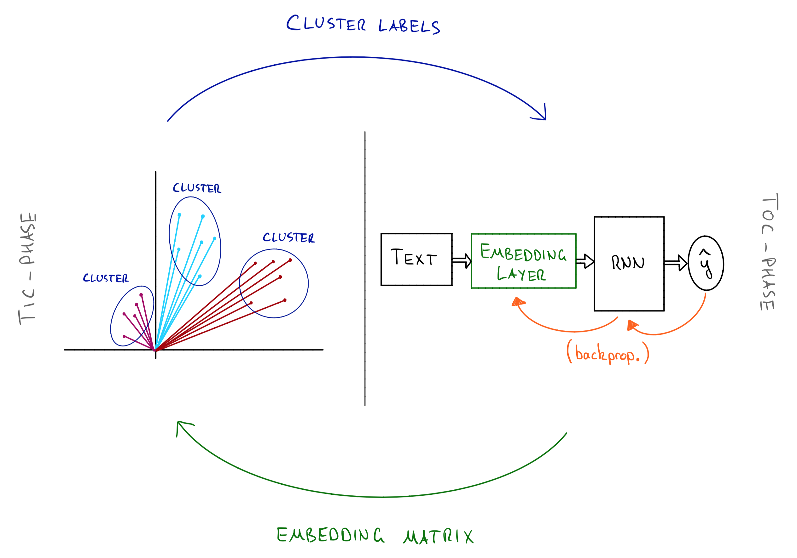

# NLP
A (growing) collection of projects, experiments and examples relating to NLP.

## A Comparison of Document Embeddings for Scientific Text

We compare a variety of document embedding techniques on a corpus of mathematics papers from the [arXiv](https://arxiv.org/archive/math). The general problem is to represent texts as vectors in some meaningful way (relationships between the texts are captured as relationships between their corresponding vectors).

In particular, the following techniques are compared:

- One-hot embedding
- Word-to-vec (w2v)
- TFIDF Analysis
- Latent Semantic Analysis (LSA)
- Hashing

### Detecting clusters in the space of embedded documents

We compare the effectiveness of the given embeddings as follows. The arXiv papers in our dataset are labelled with mathematics subject classification codes (MSCs). After we embed the papers in their respective vector spaces, we run **k-means** to detect clusters in the data. We can then compare the cluster labels (y_hat) with the MSC labels (y); There is a numeric comparison called the **V-measure**, or for the more visually inclined we have the following:

Here the `(i,j)` entry counts the number of papers in cluster-`i` and with code-`j`.

For a more thorough description see my [webpage](https://aminsaied.github.io/attachments/comparison_of_doc_embeddings/comparison_of_document_level_embeddings.slides.html).

## Building a Deep RNN with Bidirectional GRUs in Keras

We use Keras to build and train a deep RNN with bidirectional GRU cells to classify mathematics text by subject.

The purpose of this script is two-fold:

1. To build a light-weight version of our [Cornetto](https://github.com/aminsaied/cornetto) library for demonstration purposes.
2. As an excuse to build an RNN with Keras.

[Cornetto](https://github.com/aminsaied/cornetto) was designed to classify mathematics papers based only on their abstracts. Here we reproduce its underlying model - albeit with Keras, as opposed to directly in TensorFlow.

Here's a sketch of the model we'll build.

where:

- `x^i` is the `i`-th input: for us, the `i`-th word in the abstract
- GRU cells allow for long-range dependencies and are faster to train then LSTM cells
- the orange arrows pass a hidden state from left-to-right
- the green arrows pass a hidden state from right-to-left (this is the bidirectional part!)

It turns out I'm a big fan of Keras! As you'll see here, we can get a fairly intricate network up and running very quickly and with minimal fuss. In just 7 lines of code, and with a small dataset we get an accuracy of ~80-85%.

I go into more detail on my [webpage](https://aminsaied.github.io/attachments/rnn_keras/rnn_keras.slides.html).

## Tictoc Text Clustering Algorithm

This is an experimental algorithm designed to identify subjects in scientific text. It has two alternating steps - a tic-step and a toc-step.

### Tic Step
- Embed documents with _fixed_ embedding matrix `E`
- Run K-means (or EM algorithm) to identify clusters labels `y`
- Pass cluster labels to toc-step

### Toc Step
- Train an RNN with an embedding layer `E` to predict _fixed_ cluster labels `y`
- Update embedding layer as part of training (via backprop)
- Pass updated embedding matrix `E` to tic-step

Here is an overview of the algorithm.

We set up a small experiment:

~~~~
python3 tictoc_experiment.py
~~~~

It seems to show improvement in both the V-measure of the clusters and in the accuracy of the RNN both in the order of 1-2%. Caveat: one small experiment, tiny dataset. But at least it didn't just collapse to something trivial :-)

Next steps:
- examine the changes to the word embeddings: how dramatically are word-vectors changing?
- examine changes to the clusters: how dynamic are the changes to the clusters?

