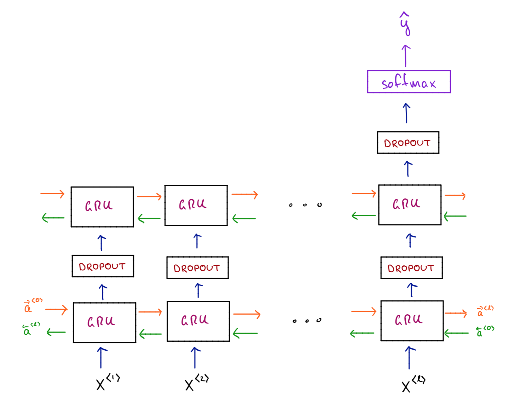

# Building a Deep RNN with Bidirectional GRUs in Keras

We use Keras to build and train a deep RNN with bidirectional GRU cells to classify mathematics text by subject.

To run the script:

~~~~
$ python3 rnn_bidirectional_gru.py
~~~~

The purpose of this script is two-fold:

1. To build a light-weight version of our [Cornetto](https://github.com/aminsaied/cornetto) library for demonstration purposes.
2. As an excuse to build an RNN with Keras.

[Cornetto](https://github.com/aminsaied/cornetto) was designed to classify mathematics papers based only on their abstracts. Here we reproduce its underlying model - albeit with Keras, as opposed to directly in TensorFlow.

Here's a sketch of the model we'll build.

where:

- `x^i` is the `i`-th input: for us, the `i`-th word in the abstract
- GRU cells allow for long-range dependencies and are faster to train then LSTM cells
- the orange arrows pass a hidden state from left-to-right
- the green arrows pass a hidden state from right-to-left (this is the bidirectional part!)

It turns out I'm a big fan of Keras! As you'll see here, we can get a fairly intricate network up and running very quickly and with minimal fuss. In just 7 lines of code, and with a small dataset we get an accuracy of ~80-85%.

I go into more detail on my [webpage](https://aminsaied.github.io/attachments/rnn_keras/rnn_keras.slides.html).
